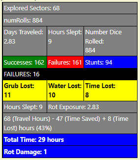

The Mutant Year Zero (MYZ) Fast Travel script allows the GM or players to specify information about already traveled sectors in order to generate rot exposure, time elapsed, and failure consequences in one roll.

For late game campaigns, once the players have some longer paths mapped out between points of interest, this allows the journey to be resolved quickly but realistically so the cost in supplies and exposure to rot are respected whilst allowing the game to move along quickly to unexplored sectors, adventure sites, and other fun stuff.

Example chat output:



Once you install the script in your game, you can run it via command like the following (with some example values that you would want to change for your needs):

`!fast-travel 15:"Yes":"No":0:18:3:5:5:3:0`

The parameters are explained below. But before that, I want to point out you can create a **macro to present dialog** for entering this information by creating a new macro and pasting the following (be sure to change values to reflect your desired default values); note: do not put line breaks or otherwise alter the macro text, paste it as-is:

```
!fast-travel ?{Travel Hours Per Day|15}:?{Vehicles|Yes|No}:?{Is Ocean|No|Yes}:?{Number of Oasis Sectors|0}:?{Number of Weak Rot Sectors|18}:?{Number of Heavy Rot Sectors|3}:?{Stalker Agility|5}:?{Stalker Find the Path|5}:?{Stalker Gear Bonuses|3}:?{Night Hours Marched (increases failures, decreases time)|0}
```

The parameters are separated by a colon and they represent (from left to right):

* **Travel Hours Per Day**: how many daylight hours can be travelled safely (i.e. if dawn to dusk is 6am to 10pm then you have 15 travel hours).
* **Party Has Vehicles**: Yes means 1 hour per sector, No means 2 hours per sector (which may be lessened based on stunts rolled).
* **Is Ocean**: Yes means that rot will be randomly rolled for every sector travelled, No means rot will be based on input of Oasis/Weak/Heavy. NOTE: the numbers input for those three textboxes will be added together if Is Ocean is Yes, so you could just enter total number of sectors in one of the three and leave the others as zero.
* **Oasis Rot Sectors**: number of sectors they will pass through with Oasis rot level.
* **Weak Rot Sectors**: number of sectors they will pass through with Weak rot level.
* **Heavy Rot Sectors**: number of sectors they will pass through with Heavy rot level.
* **Stalker Agility**: agility score of stakler finding the path (or non-stalker).
* **Stalker Find the Path**: skill points (will be zero for non-stalker).
* **Stalker Gear Bonuses**: for example, binoculars give +2 to FIND THE PATH
* **Night Hours Marched**: how many of the dark hours party will travel. Each dark hour travelled lessens time to destination but greatly increases failures.
The results are determined by artifacts, environements, and threats from the core Mutant Year Zero book.

The basic algorithm is:
Figure out the base travel time it would take based on the number of sectors and whether party is using vehicle(s) or not. Then, travel time is modified based on successes, failures, and stunts from roll derived from Stalker's attributes.

The number of failure dice dictates how many failure rolls will be made by dividing the number of failures rolled by 10. This is meant to represent the aggregation of pushed rolls, random encounters, etc. Just a simple way to calculate how much "failure" the travel experiences.

Failure rolls are 50% likely to have no effect. The other 50% of the time they can cause loss of grub, water, or time.

Note that for every hour of Night marched, that the percentage of night hours divided by travel hours per day multiplied by number of sectors traveled is added to the number of failure rolls. In other words, travelling at night will get you there faster but will increase number of failure rolls.

Rot exposure is calculated, allowing for Weak rot exposure during sleeping hours, and by modifying the rot exposure by the percentage of time saved (which accounts for time saved due to stunts and time lost due to failure rolls).  If the travel was marked as Is Ocean "Yes" then the rot is randomly determined for each sector.

Other game materials can be found at https://www.smokeraven.com and any issues with the script can be
addressed in the github repo or email raven@smokeraven.com.